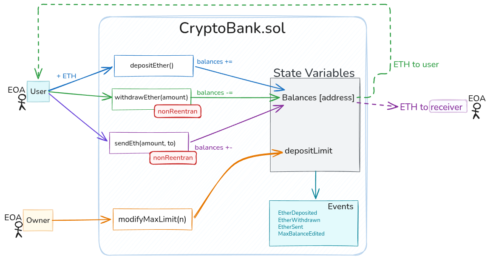

# Crypto Bank

> **Version:** V.0.1.0 **Solidity:** 0.8.33 **Framework:** [Foundry](https://getfoundry.sh)

A multi-user Ether bank implemented as a Solidity smart contract. The contract acts as a registry of balances per address, enforces a configurable per-user deposit cap, and exposes a hand-crafted access control system for the contract owner. No external dependencies — zero third-party libraries.



The diagram shows the two external actors (User and Owner), the four public entry points, the modifier guards each function passes through, how state variables are affected, and which events are emitted as a result.


## How It Works

```
User  ──► depositEther()     ── balances[user] +=  ──► EtherDeposited
User  ──► withdrawEther()    ── balances[user] -=  ──► ETH sent to user  ──► EtherWithdrawn
User  ──► sendEth()          ── balances re-routed ──► ETH sent to recv  ──► EtherSent
Owner ──► modifyMaxLimit()   ── depositLimit =      ──► MaxBalanceEdited
```

1. **Deposit** — The caller sends ETH with the transaction. The contract checks the deposit is non-zero and that the new total does not exceed `depositLimit`. If both checks pass, `balances[msg.sender]` is incremented by `msg.value`.

2. **Withdrawal** — The caller specifies an `amount`. The `checkTransferAmount` modifier validates the amount is positive and within the caller's balance. The balance is decremented **before** the Ether is sent (Checks-Effects-Interactions pattern), protecting against reentrancy.

3. **Peer transfer** — Works like a withdrawal but instead of sending ETH out to the caller, it credits `balances[to_]` and sends the ETH directly to the recipient address. The recipient's resulting balance must not exceed `depositLimit`.

4. **Limit management** — The owner can call `modifyMaxLimit` at any time to adjust the cap. A zero value is explicitly rejected.

## Deployment

```bash
# Install Foundry
curl -L https://foundry.paradigm.xyz | bash && foundryup

# Build
forge build

# Deploy locally (default: 10 ETH limit, deployer = owner)
anvil
forge script script/CryptoBankDeployScript.s.sol --broadcast --rpc-url http://127.0.0.1:8545

# Deploy to testnet
forge script script/CryptoBankDeployScript.s.sol --broadcast --rpc-url <RPC_URL> --private-key <PRIVATE_KEY>
```
<!--
## Testing

```bash
forge test -vvv
```

> Test suite is scaffolded in `test/CryptoBank.t.sol`. Full coverage is in progress.

---
-->
## Security Notes

### Manual Reentrancy Guard

This contract implements a **hand-crafted reentrancy guard** without relying on OpenZeppelin or any external library. The mechanism is a private boolean lock — `_locked` — combined with the `nonReentrant` modifier:

```solidity
bool private _locked;

modifier nonReentrant() {
    require(_locked == false, "Reentrant call");
    _locked = true;
    _;
    _locked = false;
}
```

**How it works:**

1. Before executing, `nonReentrant` asserts `_locked == false` then sets it to `true`.
2. The function body runs, including the external `.call{value:}` that sends ETH.
3. If a malicious `receive()` or `fallback()` attempts to re-enter, `nonReentrant` finds `_locked == true` and **reverts**, blocking the attack.
4. After normal completion, `_locked` is reset to `false`.

If the guarded function reverts for any reason, Solidity rolls back **all state changes** in the transaction — including `_locked = true`. The lock releases automatically; the contract is never left permanently locked.